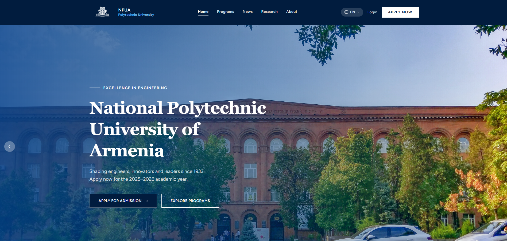
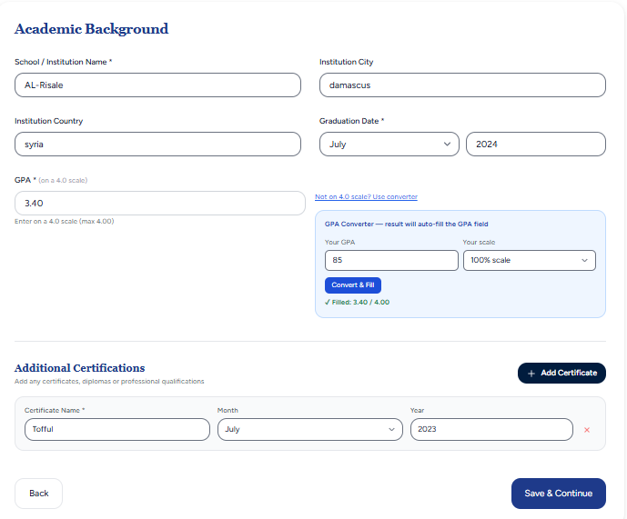
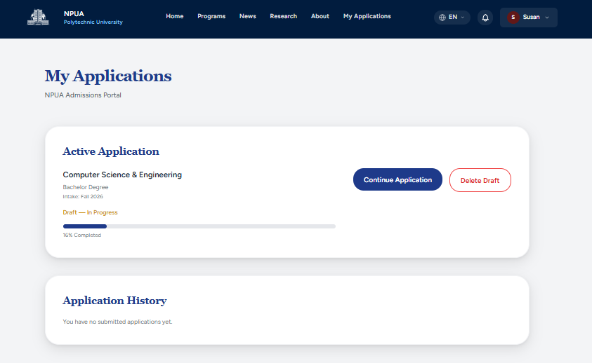
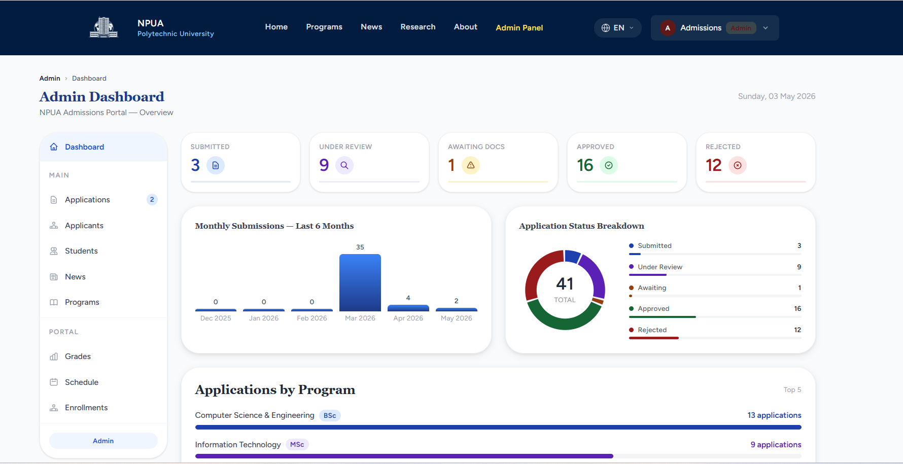
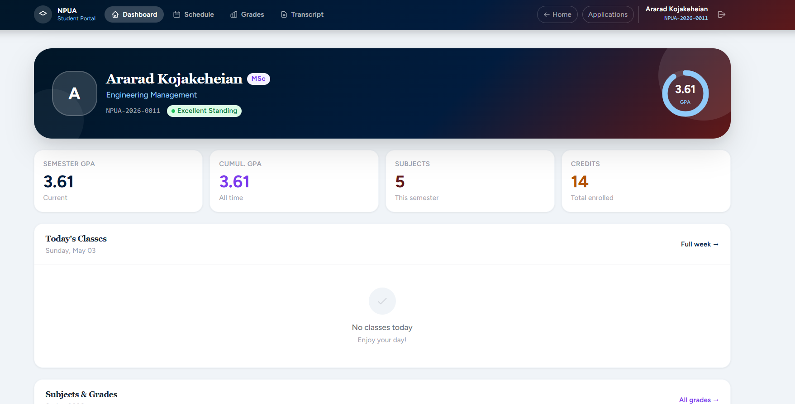
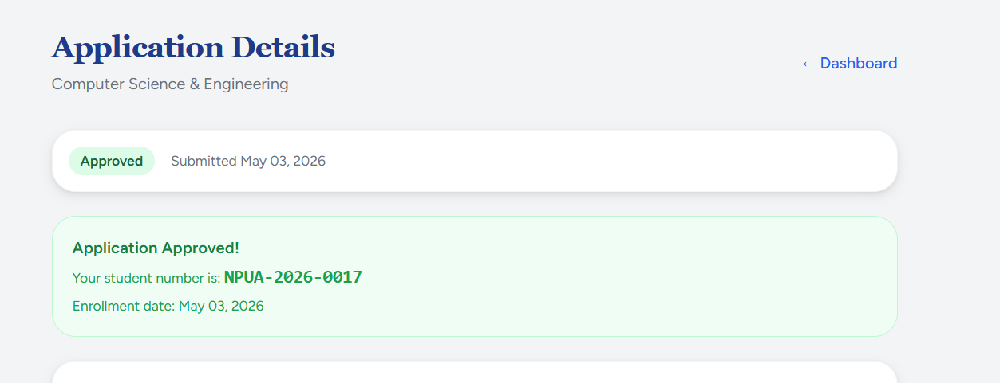

# MOSRAC Admissions & Student Portal

A full university management system that takes a student from **online application all the way to enrollment** — built as my engineering diploma project at the National Internship Portal of Armenia.

It covers three real user journeys (applicant, admissions admin, enrolled student) in one Laravel application, with a full document-upload and review workflow and a trilingual interface (English, Russian, Armenian).

> **How to view it:** this project is **run locally** — the screenshots below show it in action, and the [setup steps](#running-it-locally) will get it running on your machine in a few minutes.

**Built by:** [Nareg Marashlian](https://nareg-16.github.io/Portfolio/)

---

## Screenshots

### Public site


### Applicant
| Application wizard (with GPA converter) | My applications (draft + progress) |
|---|---|
|  |  |

### Admissions admin


### Enrolled student
| Approved → auto-enrolled | Student portal |
|---|---|
|  |  |

---

## What it does

### Applicant
- **Multi-step application wizard** with validation at each step and autosave.
- **Document uploads** (passport, transcript, recommendation, personal statement).
- A built-in **GPA converter** (e.g. 100-point scale → 4.0 scale).
- Track application status and progress from a personal **"My Applications"** area.

### Admissions admin
- **Dashboard** with live stats (submitted / under review / awaiting docs / approved / rejected) and charts.
- **Review-and-approval workflow** — open an application, view uploaded documents, and approve or reject.
- Approving an application **automatically creates a student record** with a generated student number.

### Enrolled student
- Personal dashboard with **GPA, subjects, credits, grades, and class schedule**.

### System-wide
- **Trilingual UI**: English, Russian, Armenian (Laravel localization).
- **Role-based access**: applicant / admin / super admin / student each see only their own area.

---

## Tech stack

| Layer | Technology |
|---|---|
| Framework | Laravel 12 (PHP 8.2+) |
| Database | MySQL 8 |
| Views | Blade templates |
| Front-end | Tailwind CSS, Alpine.js, Vite |
| Auth & roles | Laravel authentication + role-based middleware |
| Localization | Laravel i18n (en / ru / hy) |

---

## Running it locally

**Requirements:** PHP 8.2+, Composer, MySQL 8, Node.js 18+.

```bash
# 1. Clone
git clone <your-repo-url>
cd MOSRAC-complete

# 2. Install back-end and front-end dependencies
composer install
npm install

# 3. Environment
cp .env.example .env
php artisan key:generate

# 4. Configure the database in .env (DB_DATABASE / DB_USERNAME / DB_PASSWORD),
#    then create the schema and demo data
php artisan migrate --seed

# 5. Link storage so uploaded documents are served
php artisan storage:link

# 6. Build front-end assets, then run
npm run build          # or: npm run dev   (for hot-reloading during development)
php artisan serve
# open http://127.0.0.1:8000
```

### Demo accounts
Created automatically by the database seeder, so reviewers can log straight in:

| Role | Email | Password |
|---|---|---|
| Super Admin | `superadmin@MOSRAC.am` | `password` |
| Admissions Admin | `admin@MOSRAC.am` | `password` |
| Applicant / Student | `applicant@MOSRAC.am` | `password` |

> These are local demo accounts with seeded (non-real) data — safe to share.

---

## Project status

Completed engineering diploma project, currently **run locally** (not yet hosted). The screenshots above and the setup steps below demonstrate it working end to end. Possible next steps: host a public demo instance, add automated tests, and expand the scheduling module.

---

## License

© 2026 Nareg Marashlian. **All rights reserved.**
This repository is shared for portfolio and evaluation purposes only. The code is **not** licensed for reuse, redistribution, or commercial use without written permission.
